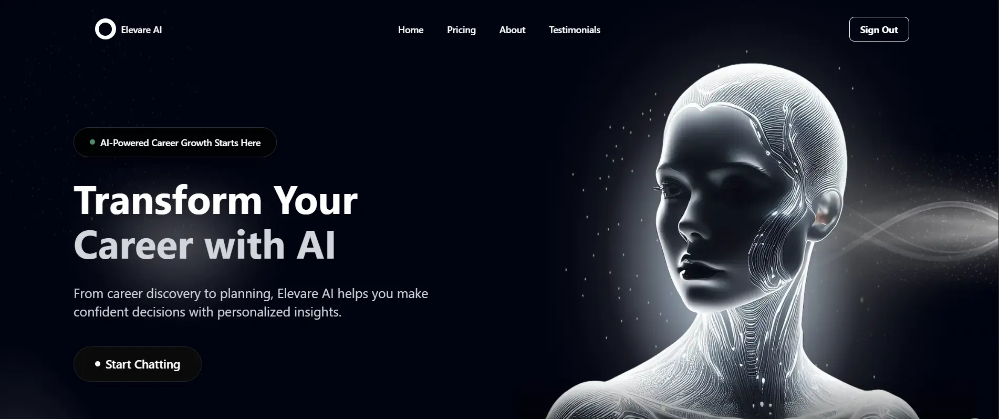

# 🚀 Elevare AI - AI-Powered Career Counselor

<div align="center">


*Transform Your Career with AI-Powered Guidance*


[](https://nextjs.org/)
[](https://www.typescriptlang.org/)
[](https://tailwindcss.com/)
[](https://prisma.io/)
[](https://trpc.io/)

[🎥 **Watch Demo Video**](#-demo-video) • [📖 **Documentation**](#-documentation) • [🚀 **Quick Start**](#-quick-start) • [💬 **Community**](#-community)

</div>

[](https://careercounselor-blue.vercel.app)

---

## 📋 Table of Contents

- [✨ Features](#-features)
- [🎥 Demo Video](#-demo-video)
- [🖼️ Screenshots](#️-screenshots)
- [🚀 Quick Start](#-quick-start)
- [🛠️ Tech Stack](#️-tech-stack)
- [📁 Project Structure](#-project-structure)
- [⚙️ Configuration](#️-configuration)
- [🔧 Development](#-development)
- [📦 Deployment](#-deployment)
- [🤝 Contributing](#-contributing)
- [📄 License](#-license)
- [💬 Community](#-community)

---

## ✨ Features

### 🧠 **AI Career Counselor**
- Personalized career guidance powered by advanced AI
- Context-aware conversations that understand your background
- Real-time career insights and recommendations

### 📄 **Resume Analysis**
- Instant AI-powered resume feedback
- Optimization tips to make your resume stand out
- Industry-specific recommendations

### 🎯 **Interview Preparation**
- AI-powered mock interviews tailored to your target role
- Industry-specific question banks
- Performance feedback and improvement suggestions

### 💰 **Salary Negotiation**
- Market insights and salary benchmarks
- Proven negotiation strategies
- Industry-specific compensation data

### 🎯 **Skill Gap Analysis**
- Identify missing skills for your career goals
- Personalized learning recommendations
- Progress tracking and milestone celebration

### 🤝 **Network Strategy**
- AI-guided networking strategies
- Professional connection building tips
- Industry-specific networking advice

### 🗺️ **Career Roadmapping**
- Clear, actionable career roadmaps
- Step-by-step guidance from current to target position
- Milestone tracking and progress monitoring

### 📊 **Success Tracking**
- Monitor your career advancement progress
- Celebrate achievements and milestones
- Data-driven insights into your growth

---

## 🎥 Demo Video

<div align="center">

### 🎬 **Product Demo**

[](https://youtu.be/Bl6RP6xPgyE)

*Click to watch the full product demonstration*

**What you'll see in the demo:**
- 🚀 Landing page and user onboarding
- 💬 AI chat interface and conversation flow
- 📊 Dashboard and feature overview
- ⚙️ Settings and customization options
- 📱 Mobile responsiveness

</div>

---

## 🖼️ Screenshots

<div align="center">

### 🏠 **Landing Page**


### 💬 **Chat Interface**


</div>

---

## 🚀 Quick Start

### Prerequisites

- **Node.js** 18.0 or later
- **npm** or **yarn** package manager
- **Git** for version control

### Installation

1. **Clone the repository**
   ```bash
   git clone https://github.com/Adi4512/careercounselor.git
   cd elevare-ai
   ```

2. **Install dependencies**
   ```bash
   npm install
   # or
   yarn install
   ```

3. **Set up environment variables**
   ```bash
   cp .env.example .env.local
   ```
   
   Fill in your environment variables:
   ```env
   # Database
   DATABASE_URL="your-database-url"
   
   # NextAuth.js
   NEXTAUTH_URL="http://localhost:3000"
   NEXTAUTH_SECRET="your-secret-key"
   
   # OAuth Providers
   GOOGLE_CLIENT_ID="your-google-client-id"
   GOOGLE_CLIENT_SECRET="your-google-client-secret"
   
   # AI Service
   OPENAI_API_KEY="your-openai-api-key"
   
   # Supabase (if using)
   NEXT_PUBLIC_SUPABASE_URL="your-supabase-url"
   NEXT_PUBLIC_SUPABASE_ANON_KEY="your-supabase-anon-key"
   ```

4. **Set up the database**
   ```bash
   npx prisma generate
   npx prisma db push
   ```

5. **Start the development server**
   ```bash
   npm run dev
   # or
   yarn dev
   ```

6. **Open your browser**
   Navigate to [http://localhost:3000](http://localhost:3000)

---

## 🛠️ Tech Stack

### **Frontend**
- **Next.js 15.5.3** - React framework with App Router
- **TypeScript 5.0** - Type-safe JavaScript
- **Tailwind CSS 3.4.17** - Utility-first CSS framework
- **Framer Motion 12.23.12** - Animation library
- **Radix UI** - Accessible component primitives
- **Lucide React** - Beautiful icon library

### **Backend**
- **tRPC 11.5.1** - End-to-end typesafe APIs
- **Prisma 6.16.1** - Database ORM
- **NextAuth.js 4.24.11** - Authentication
- **Zod 4.1.8** - Schema validation

### **Database**
- **SQLite** (Development)
- **PostgreSQL** (Production ready)

### **AI & Analytics**
- **OpenAI API** - AI-powered conversations
- **TanStack Query 5.87.4** - Data fetching and caching

### **Deployment**
- **Vercel** (Recommended)
- **Docker** support included

---

## 📁 Project Structure

```
elevare-ai/
├── app/                    # Next.js App Router
│   ├── api/               # API routes
│   ├── chat/              # Chat page
│   ├── about/             # About page
│   ├── pricing/           # Pricing page
│   └── testimonials/      # Testimonials page
├── components/            # React components
│   ├── chat/              # Chat-related components
│   ├── ui/                # Reusable UI components
│   └── magicui/           # Custom UI components
├── hooks/                 # Custom React hooks
├── lib/                   # Utility libraries
├── server/                # tRPC server code
│   └── routers/           # API route handlers
├── prisma/                # Database schema
├── public/                # Static assets
└── types/                 # TypeScript type definitions
```

---

## ⚙️ Configuration

### Environment Variables

| Variable | Description | Required |
|----------|-------------|----------|
| `DATABASE_URL` | Database connection string | ✅ |
| `NEXTAUTH_URL` | Base URL for authentication | ✅ |
| `NEXTAUTH_SECRET` | Secret for JWT signing | ✅ |
| `GOOGLE_CLIENT_ID` | Google OAuth client ID | ✅ |
| `GOOGLE_CLIENT_SECRET` | Google OAuth client secret | ✅ |
| `OPENAI_API_KEY` | OpenAI API key for AI features | ✅ |
| `NEXT_PUBLIC_SUPABASE_URL` | Supabase project URL | Optional |
| `NEXT_PUBLIC_SUPABASE_ANON_KEY` | Supabase anonymous key | Optional |

### Database Setup

1. **SQLite (Development)**
   ```bash
   npx prisma generate
   npx prisma db push
   ```

2. **PostgreSQL (Production)**
   ```bash
   npx prisma migrate deploy
   ```

---

## 🔧 Development

### Available Scripts

```bash
# Development
npm run dev          # Start development server
npm run build        # Build for production
npm run start        # Start production server
npm run lint         # Run ESLint

# Database
npm run db:generate  # Generate Prisma client
npm run db:push      # Push schema changes
npm run db:migrate   # Run migrations
```

### Code Quality

- **ESLint** - Code linting
- **TypeScript** - Type checking
- **Prettier** - Code formatting (recommended)


## 📦 Deployment

### Vercel (Recommended)

1. **Connect your repository to Vercel**
2. **Set environment variables in Vercel dashboard**
3. **Deploy automatically on push to main branch**

[](https://vercel.com/new/clone?repository-url=https://github.com/your-username/elevare-ai)


### Manual Deployment

```bash
# Build the application
npm run build

# Start production server
npm run start
```

---

## 🤝 Contributing

We welcome contributions! Please see our [Contributing Guidelines](CONTRIBUTING.md) for details.


## 📄 License

This project is licensed under the MIT License - see the [LICENSE](LICENSE) file for details.

---

## 💬 Community

### Get Help

- 📖 [Documentation](https://docs.elevare-ai.com)
- 💬 [Discord Community](https://discord.gg/elevare-ai)
- 🐛 [Report Issues](https://github.com/your-username/elevare-ai/issues)
- 💡 [Feature Requests](https://github.com/your-username/elevare-ai/discussions)

### Stay Updated

- ⭐ **Star this repository** to show your support
- 👀 **Watch for releases** to stay updated
- 🍴 **Fork the project** to contribute

### Social Media

- 🐦 [Twitter](https://twitter.com/adisha_10)
- 💼 [LinkedIn](https://linkedin.com/in/adityasharma14)
- 📧 [Email](mailto:adityasharma4510@gmail.com)

---

<div align="center">

**Made with ❤️**

[⬆ Back to Top](#-elevare-ai---ai-powered-career-counselor)

</div>
